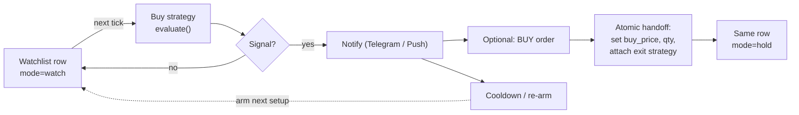
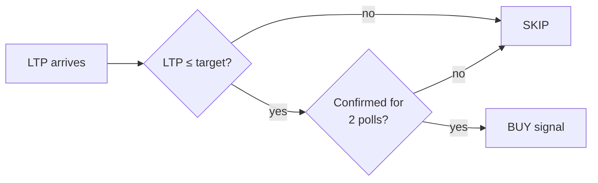
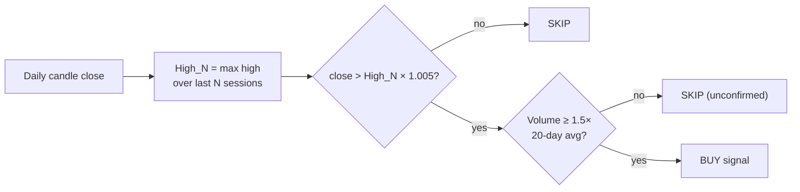
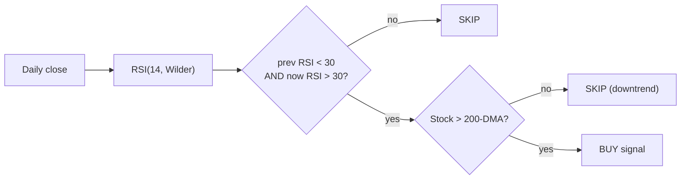
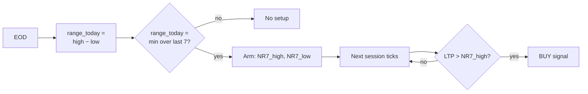
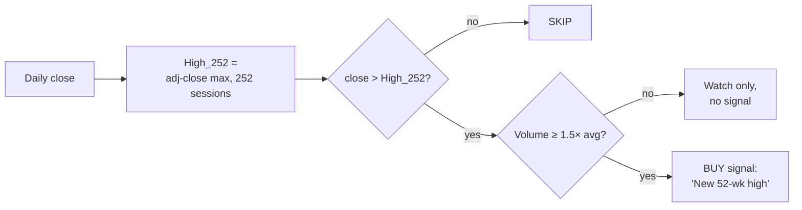
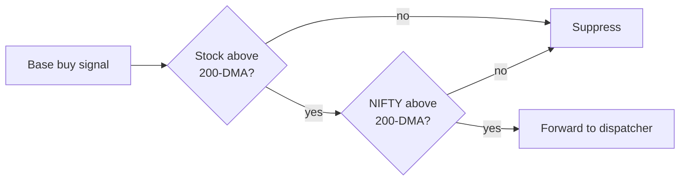

> **Risk disclaimer.** This is a personal project, not financial advice. Every signal in this post has lost real money for someone, somewhere. Backtest before you wire any of it to an order endpoint.

The bot already knows how to leave a trade. The [trailing-stop engine](/blog/fintech/stalkmarket-trailing-stop-strategy) has been running on a Pi for months, ratcheting stops on positions I forgot I held. It does its job and shuts up.

But "knows when to sell" is half a system. The other half is the part I've been avoiding: when should it tell me to **buy**?

I sat down to enumerate options and the list went to twenty-five before I made myself stop. Limit-below bids, breakouts, RSI dips, MACD crosses, golden crosses, NR7s, squeezes, gap-ups, post-earnings drift, sector rotation, the works. Every one of them sounds great in a YouTube thumbnail. Most of them, on closer reading, are a bad idea for a single-user bot polling LTPs from a Raspberry Pi.

This post is the cull. Five entries make the cut. Two more sneak in as filters that sit in front of everything else. The rest get a sentence each at the bottom explaining why I'm not building them — at least not yet.

Throughout, I'll use **HDFC Bank (NSE: HDFCBANK)** at a reference price of **₹1,500** as the running example. Round numbers, familiar name, easier to picture.

## Why entries are nothing like exits

Before I started filtering, I had to write down why my exit instincts wouldn't carry over. They mostly don't.

An exit strategy is anchored to a price you actually paid. The whole trailing-stop math hangs off `buy_price`; every decision is "where is the market relative to where I got in?" Buys have nothing like that. The only state available is whatever the market itself is doing — highs, lows, indicators, volume — none of which is _yours_.

Exits also have a single saving invariant: the stop only moves up. Almost every bug in a trailing-stop engine ends up violating that one rule, which makes them easy to find. Buys have no equivalent. A signal can fire, un-fire when the setup invalidates, and re-fire next month. That makes buy strategies a nightmare to test naively, because "did it trigger?" is no longer a function of the current price alone — it's a function of every tick that came before.

And then there's the spam problem. A 50-DMA crossover that fires once at 10:04 a.m. is fine. The same crossover firing thirty times before lunch as price oscillates around the line is not. Every buy strategy has to declare its **re-arm rule**: when, if ever, am I allowed to fire again? Without that, every signal on the list degenerates into noise.

There's also a small but consequential structural change to the database. StalkMarket today knows about _holdings_ — stocks the user has bought. Buys need a notion of _watchlist_ — stocks the user is interested in but doesn't yet own. Same row in the table, different mode:



The handoff arrow on the bottom-right is the one I lose sleep over. A buy that places an order without atomically attaching an exit strategy leaves the user with an unmanaged position — strictly worse than not buying at all. I'd rather fire no buy signals for a year than fire one whose exit isn't wired up before the order goes in.

## How I scored them

Five rough axes. None of them precise enough to defend in a paper, but together they made the calls obvious.

I wanted **edge** that holds up on Indian large- and mid-caps, not just on the S&P. I wanted **infra cost** to be modest — adding a strategy shouldn't mean a new data feed. I cared about the **failure mode**: when the signal is wrong, is it wrong by a little or by a lot? I wanted **re-arm clarity** — could I write the rule down without weaseling? And I wanted **composability** with the trailing-stop exit, because the whole appeal of a pluggable engine is that buys and exits should snap together.

What survived: a dead-simple limit bid, a Donchian breakout, an RSI dip-and-reclaim, an NR7 setup, and a 52-week-high momentum trigger. Two more — a volume confirmation and a 200-DMA trend filter — I'd insist on layering on top of almost everything else.

## The simplest one first: a smarter limit order

The very first thing I want to ship is also the most boring. The user picks a target price, the bot watches, and when LTP touches that price (and stays there for a poll or two), it fires.



Concretely, with `target = ₹1,450`:

| Tick |    LTP | Action         |
| ---: | -----: | -------------- |
|    1 | ₹1,500 | SKIP           |
|    2 | ₹1,452 | SKIP           |
|    3 | ₹1,450 | armed (1/2)    |
|    4 | ₹1,449 | **BUY signal** |

This is, on its face, a resting limit order — something the broker will happily do for you. So why does the bot need to know about it at all?

Because the moment the bot owns the entry, the rest of the system clicks into place. The same row that held the watchlist target now holds the position; the cooldown machinery suppresses duplicate notifications; the buy-to-exit handoff attaches a trailing stop the instant the order fills. None of that exists if you let the broker manage the bid.

The honest weakness of this strategy is that it has no opinion about _why_ price is touching your bid. Most of the time price reaches a level because something is wrong — a downgrade, a surprise quarter, a sector hit — and your "patient accumulation" turns into a falling knife. A static target also goes stale: ₹1,450 is meaningful today and meaningless six months from now, after the stock has spent two months at ₹1,800. I'll add an optional auto-expire after N days, mostly to protect users from themselves.

## Buying strength: the Donchian breakout

The Turtles bought new highs. Specifically, they bought when price closed above the highest high of the previous twenty sessions, and they didn't apologise for being late. The same idea, mirrored from my [planned Donchian _exit_](/blog/fintech/stalkmarket-trailing-stop-strategy), gives StalkMarket its first real momentum entry.



Walk through HDFC over two days, with a 20-day lookback:

```
Day -20 .. Day -1 high water mark: ₹1,560
Day  0  close:                     ₹1,565   →  > 1,560 × 1.005 (1,567.8)?  no, skip
Day  1  close:                     ₹1,572   →  yes; volume 1.4cr vs 80L avg → 1.75× → BUY
```

The 0.5% buffer is doing real work there. Without it, the strategy fires on Day 0 — a hairline poke above the prior high that closes weak and reverses next morning. With it, the trigger waits for genuine displacement.

The honest pitch and the honest critique sit right next to each other. When markets trend, this is wonderful: it's parameter-light, it pairs naturally with an ATR or Donchian _trail_ on the exit (same `N` drives both ends of the trade), and it requires no indicators beyond a rolling max. When markets _range_, it's miserable. False breakouts are the dominant failure mode in NSE large-caps, and the Indian session has a particular pathology where late-day breakouts fail next morning. The volume gate isn't optional decoration; without it the signal-to-noise is genuinely poor.

The re-arm rule is the cleanest one in the list: don't fire again until price drops back below the prior `High_N` and a fresh breakout forms.

## Buying weakness, but only the right kind

RSI mean reversion is the strategy I argued with myself about the longest. It's a beautiful idea — buy a healthy stock when it's panicking — and it has eaten more accounts than almost any other rule on this list, because RSI does an evil thing in real downtrends: it stays under 30 for weeks. Every "oversold" reading is a cliff edge in disguise.

The fix is to do two things at once. Don't fire on the level — fire on the **cross back up**. And don't fire at all if the stock is below its 200-day moving average.



The 200-DMA gate isn't a refinement; it's the load-bearing wall. Without it, the strategy systematically buys into bear markets and gets shredded. With it, you're buying healthy stocks having a bad week.

```
Six red sessions in a row, RSI = 27.
Session 7: small green candle, RSI ticks up to 32.
HDFC at ₹1,510, 200-DMA at ₹1,470 → above → BUY.

Same RSI cross, but HDFC at ₹1,400, 200-DMA at ₹1,520 → SKIP.
```

The other honest thing to say about this one is that it works much better on mid-caps than on a name like HDFC. Steady large-caps rarely get _truly_ oversold; the mid-cap universe has the volatility to dip into 27, scare everyone, and recover.

## When the chart goes quiet

There's a class of setups built on the observation that volatility _contracts_ before it expands. The cleanest of those is the NR7: today's daily range is the smallest of the last seven days. Stocks don't stay quiet for long; the breakout from an NR7 is often the start of the next move.



```
Last 7 daily ranges: ₹35, ₹28, ₹22, ₹40, ₹18, ₹31, ₹14
Today's range = ₹14 → narrowest of 7 → NR7 setup armed.
NR7 high = ₹1,520, NR7 low = ₹1,506.
Tomorrow LTP tags ₹1,524 → BUY.
Initial stop sits naturally at ₹1,505 (just below NR7 low) → ~1.2% risk.
```

What I love about NR7 is that the setup _defines_ its own stop. The NR7 low is the natural invalidation level; the moment price closes back inside the range, the thesis is dead. That makes risk-based position sizing trivial — Van Tharp's formula falls out for free, with none of the usual hand-wringing about where to put the initial stop.

What the NR7 won't do is fire often. Plenty of NR7s break in the wrong direction; plenty more break in the right direction and immediately fail. Pair it with the volume gate or be prepared to take a lot of small losses for occasional clean runs.

## The momentum strategy that admits it's late

The 52-week-high breakout is the same idea as the Donchian, just with `N = 252` and a more famous fan base. The pitch comes from the Mark Minervini / Jesse Livermore lineage: stocks making new yearly highs tend to make more.



```
52-week high = ₹1,755 (set 6 months ago).
Today HDFC closes ₹1,758 on volume 2.1× the 50-day average.  → BUY.

Same close on volume 0.6× average → flag, don't fire.
Quiet 52-week highs disproportionately fail.
```

This strategy is openly, structurally late. By definition you're buying after the move has already gone somewhere. That's also the whole point: it filters out laggards by construction. You're not catching bottoms; you're paying for momentum that's already been validated by everyone else.

One operational landmine worth flagging: this strategy lives or dies by **adjusted close prices**. A 1:1 bonus that the data feed hasn't reconciled will fake-print every stock at "new 52-week highs" overnight, and the bot will faithfully fire a signal on every one. Adjusted closes aren't a nice-to-have here; they're the difference between a strategy and a comedy.

## The two filters I'd put in front of almost everything

Two of the survivors aren't strategies on their own — they're filters. They take a base buy signal as input and decide whether to forward it.

The **volume confirmation** is the cheap one: require today's volume to be at least 1.5× the 20-day average before honoring any breakout. The data is already in the daily candle, so the cost is negligible. The only awkwardness is intraday — comparing 10:30-AM volume to a full-day historical average is meaningless — so I'm planning to evaluate it only at end-of-day on confirmed closes.

The **trend filter** is the one that earns the most. Two checks: the stock has to be above its own 200-day moving average, and the NIFTY 50 has to be above _its_ 200-day moving average. Both with a small buffer to avoid hairline triggers.



This single modifier eliminates the ugliest failure modes of every other strategy on the list. It also misses the rare bottom-fishing wins — the contrarian heroics that look great in a backtest and feel awful in real time. I'll take that trade.

## What didn't make it (and why)

A short tour of the rejected pile, because the reasons are sometimes more interesting than the survivors.

| Strategy                    | Why not yet                                                                                                                                                |
| --------------------------- | ---------------------------------------------------------------------------------------------------------------------------------------------------------- |
| **Pullback to recent high** | Solid concept, but redundant once Donchian + trend filter are live. Adds parameter sprawl without new edge.                                                |
| **MA crossover (50/200)**   | Lagging by definition; the golden cross fires twice a year per stock. Worth shipping later as an _alert_, not as a primary signal.                         |
| **Bollinger squeeze**       | Genuinely high quality. Held back only because "what counts as a squeeze" is parameter-heavy and harder to backtest cleanly. Strong second-wave candidate. |
| **MACD bullish cross**      | Smoother sibling of the MA cross with similar lag. No edge over a clean breakout plus a trend filter.                                                      |
| **Higher-highs / lows**     | Beautiful in theory; needs a formal swing-detection module. Defer until I've already built that for the swing-low _exit_.                                  |
| **Cup-and-handle**          | Real edge in the literature, but pattern recognition is hard to formalise without ML. Scope creep.                                                         |
| **Gap-up continuation**     | Intraday-tick sensitive; doesn't survive a 30-second polling cadence.                                                                                      |
| **Earnings reaction**       | Needs a reliable earnings calendar feed I don't have today.                                                                                                |

And four I cut entirely, not deferred:

- **Sector rotation** wants a curated sector → benchmark map, ranked daily. Pure infra cost with marginal edge for a single-user bot.
- The **VIX / breadth regime gate** is reactive; by the time VIX spikes, the worst is usually already in. The 200-DMA trend filter does most of the same work with less data.
- **Pre-bonus / dividend anticipation** has dubious edge, and corporate actions already break half the candle-based math. Adding a strategy that _encourages_ trading through them is the wrong direction.
- **Relative strength** has the same per-stock benchmark mapping problem as sector rotation. Same answer.

## How this clicks into the existing engine

The shape of the buy side mirrors the exit side almost exactly. A `BuyStrategy` interface, a pure `evaluate()` function, a discriminated union for the result. The two new variants compared to exits are `ARMED` and `INVALIDATED`, because most buy strategies have a multi-step lifecycle (a setup forms, then triggers, then either succeeds or invalidates) where exits don't. Splitting those into their own action variants lets the poller treat them differently — `ARMED` is silent state, only `BUY` actually pings the user.

I'm starting notify-only. Auto-placed BUY orders only get switched on per-stock, behind the same explicit opt-in I used for SELL execution. The blast radius of a wrong buy is much larger than a wrong stop: a wrong stop costs you the rest of an existing trend; a wrong buy spends fresh capital on a position you wouldn't have chosen.

Beyond that, there's a backtest harness already sitting in the repo from the exit work, and I'd really like to run every one of these strategies through it on five years of NSE data before any of them go live. Buy signals are far more sensitive to false positives than exit signals, and "the rule sounded good" has cost me more than I'd care to admit.

## Series

1. [Overview and architecture](/blog/fintech/stalkmarket-overview)
2. [Trailing stop-loss engine](/blog/fintech/stalkmarket-trailing-stop-strategy)
3. [Multi-broker auth](/blog/fintech/stalkmarket-multi-broker-auth)
4. **Teaching StalkMarket to buy.** You're here.
