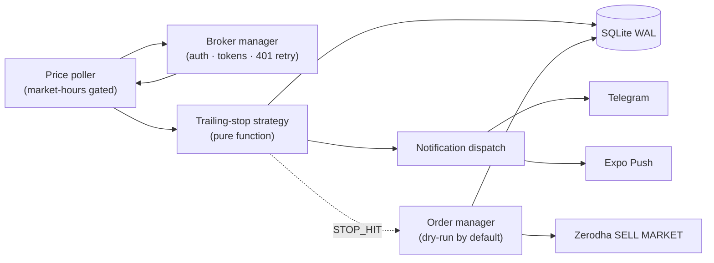

> **Risk disclaimer.** This post describes a personal project. It is not financial advice, not a SEBI-registered advisory, and not a substitute for your own research. Trading carries real risk of capital loss. Anything you build on top of these ideas, you operate at your own risk.

## The problem

I run a small, manually-managed equity portfolio on the NSE. The hardest part isn't picking stocks. It's the boring discipline of trailing stop-losses. Most market days, I'd catch myself:

- Refreshing Kite or Angel One every few minutes.
- Doing mental arithmetic: "if it hits ₹X, my stop should move to ₹Y."
- Missing a STOP_HIT because I was in a meeting.
- Talking myself out of a perfectly good rule because the candle "looked weak."

Trailing stops are a mechanical rule. Mechanical rules are exactly what a small bot should be doing.

## What StalkMarket does

StalkMarket is a long-running Node.js service that:

1. Polls live LTPs from your broker during NSE hours.
2. Runs a pluggable trailing-stop strategy per `(user, stock, buy_price)`.
3. Pushes a notification (Telegram and Expo push) the moment a stop is set, updated, or hit.
4. Optionally places the SELL MARKET exit for you on a Zerodha account.

It ships as a single Docker container on a Raspberry Pi 5, with state in SQLite, configuration via REST API, and an admin web dashboard plus a companion mobile app on top.

<!-- TODO: insert web-dashboard-live.gif (admin dashboard updating live during market hours) -->

## Architecture

The whole thing is a few hundred lines of TypeScript organized into clear vertical slices:



A handful of invariants keep the system tractable:

- **The strategy is a pure function.** No DB, no IO, no clock. Easy to test.
- **The poller owns IO.** It reads LTP, writes state, dispatches notifications, and places orders.
- **SQLite (WAL) is the source of truth.** Tokens, state, notifications, order executions: all persisted.
- **Every external boundary is validated** with Zod (config and REST bodies).

## Tech stack

| Concern     | Choice                    | Why                                             |
| ----------- | ------------------------- | ----------------------------------------------- |
| Runtime     | Node.js 20 LTS            | Built-in `fetch`, ESM-native                    |
| Language    | TypeScript (strict)       | Catches the obvious mistakes early              |
| HTTP server | Fastify                   | Schema-first, faster than Express, plugin model |
| DB          | `better-sqlite3` (WAL)    | Synchronous, fast, prebuilt arm64 binary        |
| Validation  | Zod                       | Same schemas validate config and API bodies     |
| Logging     | Pino                      | Structured JSON straight to Docker logs         |
| Tests       | Vitest                    | ESM-native, fast, useful coverage UX            |
| Container   | `node:20-slim` multi-arch | `linux/arm64` for the Pi                        |
| Mobile      | Expo / React Native       | Native push, fast iteration, no Xcode pain      |
| Web         | React + Vite              | Static-served by Fastify in production          |

## Runtime flow (per poll tick)

Each `setInterval` tick the poller:

1. Asks `market-hours.isMarketOpen()` — combines weekend, NSE holiday calendar, and 09:15–15:30 IST window. Skip if closed.
2. Fetches LTPs in one batch (deduplicated across users tracking the same symbol) via `broker/manager.getLTP()`.
3. Per `(user, stock)`, calls `trailing-stop.evaluate({ buyPrice, currentPrice, stopLossPct, marginPct, state })`.
4. Persists the resulting state and dispatches a notification through `notifications/manager` for any non-`SKIP` action.
5. On `STOP_HIT`, if order execution is enabled, hands off to `orders/manager` (Zerodha SELL MARKET).

The trailing-stop math itself, and why the discriminated `StrategyResult` matters, is the subject of [post 2](/blog/fintech/stalkmarket-trailing-stop-strategy).

## Process lifecycle

`src/index.ts` orchestrates startup as a strict, ordered sequence so the API never accepts traffic before its dependencies exist:

```
DB init
  → config load
  → notifications init
  → broker init (restore persisted tokens)
  → orders init
  → market-hours config + holiday cache
  → broker authenticate
  → start API server
  → admin HEALTH notification
  → start poller
```

`SIGTERM` and `SIGINT` reverse the order: stop poller, stop server, close DB, exit. No half-started state, no surprise during a `docker restart`.

## Notifications

The notification system is small but does most of the user-facing work:

- **Telegram.** Direct `fetch` to the Bot API; zero dependencies.
- **Expo Push.** `expo-server-sdk` for batched sends with token validation.
- Each user picks their preferred channels; failure in one doesn't block the others.
- Every notification is logged to `notification_log` with `status` and `error_details` — an audit trail comes for free.
- Admin-only events (`ERROR`, `HEALTH`) go to a separate `admin_notification` channel configured in `app.json`.

<!-- TODO: insert telegram-stop-updated.png and telegram-stop-hit.png -->

One thing that surprised me: currency formatting actually matters. Indian lakh/crore comma grouping (`₹2,45,500.00`) reads naturally in a Telegram preview; ISO grouping (`₹245,500.00`) just looks wrong.

## Web dashboard

The admin dashboard is a small React + Vite app that talks to the same Fastify API the mobile app uses. It's built into `public/` and served by Fastify in production, so the whole thing is one image on one port (`3847`).

Pages:

- **Dashboard.** At-a-glance: market open, broker status, last poll, recent notifications.
- **Stocks.** Per-user table of positions with live LTP, current stop, highest seen.
- **Notifications.** Searchable log with type filter.
- **Orders.** Execution status and manual exit-order trigger.
- **Config.** Read-only `app.json` view.

<!-- TODO: insert web-dashboard.png, web-stocks-table.png, web-notifications.png, web-orders.png -->

## Mobile app

The Expo app handles the things a phone is good at: portfolio glance, stock detail, notifications, and a sign-in flow. Push tokens are registered with Expo on login and stored against the user.

<!-- TODO: insert mobile-portfolio.png, mobile-stock-detail.png, mobile-notifications.png, mobile-settings.png -->

## Deployment: one container, one Pi

```yaml
# docker-compose.yml
services:
  StalkMarket:
    image: ghcr.io/tapanmeena/stalkmarket:latest
    restart: unless-stopped
    ports:
      - "3847:3847"
    volumes:
      - ./config:/config:ro
      - ./data:/data
    environment:
      - TZ=Asia/Kolkata
      - NODE_ENV=production
```

CI is a GitHub Actions workflow that runs lint, build, and tests, then `docker buildx` produces a multi-arch (`linux/arm64`) image and pushes to GHCR tagged with the commit SHA and `latest`. On the Pi, a deploy is `docker compose pull && docker compose up -d`.

Resource usage is small: about 80 MB of RAM, near-zero CPU between polls, and a SQLite DB that's still under 1 MB after weeks of operation. The Pi 5 has plenty of headroom for this workload, which is the point.

## What's next

A few directions I want to take this:

- More strategies: ATR / Chandelier exit, Donchian channel, breakeven-then-trail, MA stop. Sketched out in `STRATEGIES.md` and covered briefly in [post 2](/blog/fintech/stalkmarket-trailing-stop-strategy).
- Daily heartbeat notification at market open.
- Periodic SQLite backup.
- More order types beyond Zerodha SELL MARKET.
- Discord, email, and webhook notification providers.

## Series

This is part 1 of 3:

1. **Overview and architecture.** You're here.
2. [Designing a pluggable trailing stop-loss engine](/blog/fintech/stalkmarket-trailing-stop-strategy).
3. [Multi-broker auth: TOTP, OAuth, and token persistence done right](/blog/fintech/stalkmarket-multi-broker-auth).

> A reminder, since it's worth repeating: nothing in this post is financial advice. Test on a paper account, keep `auto_place_on_stop_hit` off until you trust your strategy, and never deploy code you haven't read.
